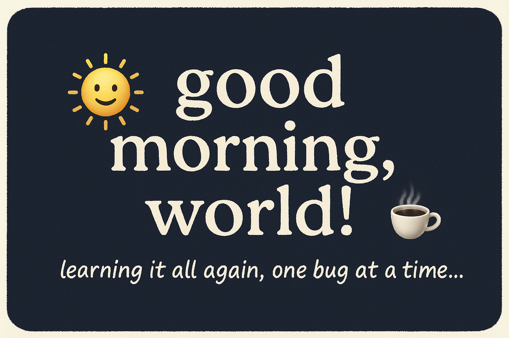

  

# good morning, world!

i am andrei – a proud morning person and i like to code.

---

## my coding powers

if you have time and take a look at the repos, you see what i use.

---

## what i am building

- learning web development **seriously** this time
- not sprinting back to react native (i made a promise… to myself and the bugs)

---

## fun facts

- had an accident, now relearning code - web development
- bugs fear the morning, and so should they

---

## let be internet friends

[linkedin](https://www.linkedin.com/in/razvan-andrei-chiper/)  
[portfolio](https://portfolio21andrei.netlify.app/)

---

  <strong> and remember...</strong>

  <em>
    the code does not stop when it is hard.  
    it stops when you walk away from what you once believed you could build.
  </em>

---
